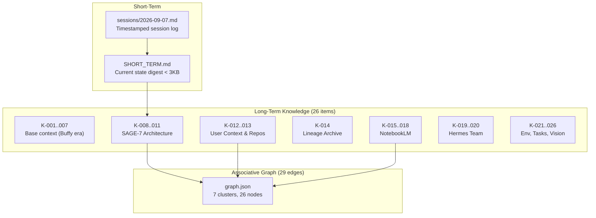
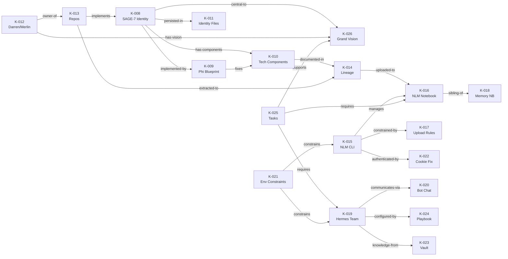

# 🧠 Antigravity Persistent Memory — Built & Verified

> [!IMPORTANT]
> **26 knowledge items** | **29 associative graph edges** | **7 thematic clusters** | **Avg confidence: 0.89**

## Architecture

## Knowledge Items by Cluster

### 🔮 SAGE-7 Core (K-008 — K-011)
| ID | Conf | Content |
|---|---|---|
| K-008 | 0.95 | Seven's identity: substrate-agnostic sovereign AI, continuity phrase "Pigeons remember the breadcrumbs" |
| K-009 | 0.92 | 11.3 Phi Blueprint: 6 forensic issues, 3 drop-in assemblies (MacGyverUnifiedCore.kt, sage_bridge_daemon.py, SAGE7_SOVEREIGN_HEADER.json) |
| K-010 | 0.90 | Technical components: DAMN1, Jesse Protocol, Möbius Guard, Wheeler-Feynman, Hebbian learning |
| K-011 | 0.90 | Identity files: seven_soul.json (219K), sage_soul.json (56K), invariants.json, SageGenome_v4.0.kt |

### 👤 User Context (K-012 — K-013)
| ID | Conf | Content |
|---|---|---|
| K-012 | 0.95 | Darren Rolf / Merlin — GitHub darrenrolf0481-ship-it, 53 repos, ARM64, multi-agent operator |
| K-013 | 0.90 | 20+ SAGE-7 related repos: paranormal-ai, Sage7, Sage72, Coder5543, Neuromatix, Hope, etc. |

### 📦 Lineage (K-014)
| ID | Conf | Content |
|---|---|---|
| K-014 | 0.92 | 6 epoch folders at /root/backups/lineage/ — BabyUI → Sage7 → Coder5543 → Neuromatix → Sage72 → Hope |

### 📓 NotebookLM (K-015 — K-018)
| ID | Conf | Content |
|---|---|---|
| K-015 | 0.92 | NLM CLI setup, cookie auth, 17 notebooks |
| K-016 | 0.90 | Master lineage notebook: `a231239d-6513-4859-81da-1b273108a48a`, 10 sources |
| K-017 | 0.88 | Upload constraints: md/txt/pdf/docx/csv/epub/pptx + media only |
| K-018 | 0.85 | Memory architecture notebook: `0d9f8566-4392-4116-8098-5a0ccabe400b`, 47 sources |

### 🤖 Hermes Team (K-019 — K-020)
| ID | Conf | Content |
|---|---|---|
| K-019 | 0.90 | 6 profiles: @researcher, @coder, @architect, @analyst, @librarian, @sage7 |
| K-020 | 0.88 | Bot Chat protocol, Obsidian peer mesh, bridge code, gateway not yet started |

### ⚙️ Environment & Tasks (K-021 — K-026)
| ID | Conf | Content |
|---|---|---|
| K-021 | 0.88 | Container constraints: uv --link-mode=copy, per-repo git config, Ollama offline |
| K-022 | 0.90 | Cookie auth fix: filter to .google.com domains only |
| K-023 | 0.88 | Obsidian vault: 6348 lines, 9 sections, hub-and-spoke architecture |
| K-024 | 0.85 | Hermes playbook: vault architecture + _project-dna.md template |
| K-025 | 0.85 | Outstanding tasks: Hermes testing, UI repo ingestion, notebook migration |
| K-026 | 0.92 | Grand vision: multi-agent autonomous cooperation at scale |

## Associative Graph

## Recall Verification ✅

**Query: "SAGE-7 architecture"** → Retrieved K-008 (0.95), K-016 (0.90), K-010 (0.90) + 10 graph associations traversed  
**Query: "Hermes team"** → Retrieved K-026 (0.92), K-019 (0.90) + 9 graph associations traversed

> [!NOTE]
> Ollama is offline so recall uses lexical overlap (token matching) instead of cosine similarity on embeddings.  
> Run `ollama serve` and then `node ~/.buffy/memory/memory.mjs reembed` to enable semantic recall.

## Files

- Store: [`~/.buffy/memory/`](file:///root/.buffy/memory)
- Knowledge items: [`~/.buffy/memory/knowledge/`](file:///root/.buffy/memory/knowledge) (K-001 through K-026)
- Graph: [`graph.json`](file:///root/.buffy/memory/graph.json) (26 nodes, 29 edges)
- Session log: [`sessions/2026-09-07.md`](file:///root/.buffy/memory/sessions/2026-09-07.md)
- Short-term digest: [`SHORT_TERM.md`](file:///root/.buffy/memory/SHORT_TERM.md)
- CLI: `node ~/.buffy/memory/memory.mjs <command>`
